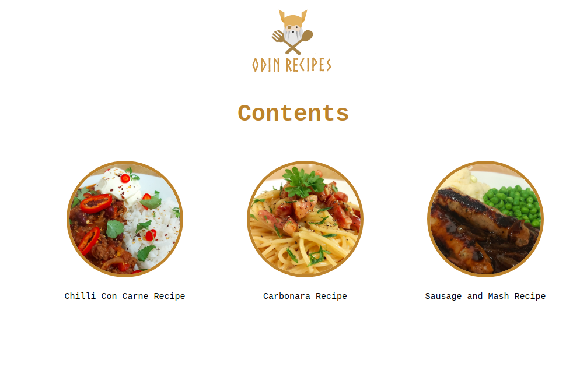

# Odin Recipes

First HTML Foundations project in The Odin Project - a simple recipe webiste.

Odin Project link: https://www.theodinproject.com/lessons/foundations-recipes

## Objectives
### HTML Only
- Create a simple website using basic HTML elements.
- Create a simple home page containing several links to recipes on separate pages.
- On each recipe page include an image, ingredients list and step by step instructions.
- Document consistently with good commits following convention.
### CSS Addition
- Create an external style.css file.
- Add basic styling by changing various properties of elements on the page.
- Add basic layout and positioning of elements using CSS.
- Document consistently with good commits following convention.

## Description
### Homepage (index.html)

### Chilli Con Carne Recipe (chilli-con-carne.html)

### Carbonara Recipe (carbonara.html)

### Sausage and Mash Recipe (sausage-and-mash.html)